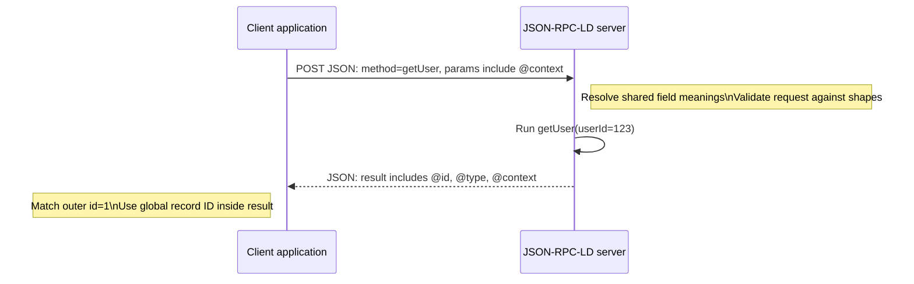
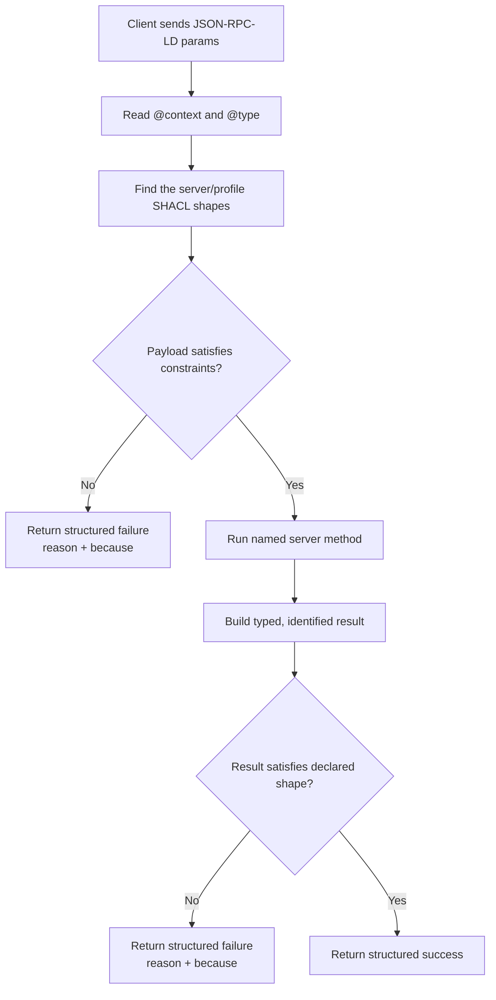

<!--
Tutorial drafted by the Manus cloud agent (task JL5ZWmo8n8riyxCrUYQ2iJ), 2026-08-14.
Review-ready draft; not independently verified.
-->

# JSON-RPC-LD for JSON & SQL developers: add stable IDs, a shared vocabulary, and validation to your API calls

**Audience:** working developers fluent in JSON and SQL.  
**Goal:** make a familiar function-style JSON API self-describing and reliably validated—without requiring you to learn SPARQL.

## 1. Start with the API pattern you already understand

Before introducing a formal name, think of a backend with named functions. Instead of calling `GET /users/123`, you `POST` a JSON body that says which function to run and supplies its arguments. The server returns JSON containing that function’s return value. That is **JSON-RPC**: calling a named server function by POSTing a small JSON request and getting a JSON response—like a REST endpoint, but you name the method inside the body.[1]

Here is a plain request to call `getUser`, followed by its plain response:

```json
{
  "jsonrpc": "2.0",
  "method": "getUser",
  "params": { "userId": 123 },
  "id": 1
}
```

```json
{
  "jsonrpc": "2.0",
  "result": {
    "name": "Aisha Khan",
    "email": "aisha@example.org"
  },
  "id": 1
}
```

The `id` at the outer level is a **call correlation ID**. It is like attaching a request number to a database job so a client can match a returned result to the call it sent. Do not confuse it with the user’s primary key. In the request, `userId: 123` is merely an agreed JSON field name. Nothing in ordinary JSON says whether it means a customer identifier, an employee identifier, a legacy key, or something else.

That ambiguity is the problem JSON-RPC-LD addresses. **JSON-RPC-LD** keeps the familiar JSON-RPC 2.0 function-call envelope, then requires the data passed into and returned from methods to declare its meaning using JSON-LD conventions.[1] [2]



> **Translation:** JSON-RPC-LD is not a replacement for JSON. It is ordinary JSON-RPC plus a schema-aware way to make the rows in `params` and `result` identifiable and unambiguous across systems.

## 2. Why ordinary JSON fields drift

Imagine two teams exchange this object:

```json
{ "status": "active", "id": 123 }
```

From a SQL perspective, this is like receiving `SELECT status, id ...` with no database, schema, table, column definitions, or key contract. One team may mean account status; another may mean employment status. One may treat `id` as an integer user key, while the other treats it as a product key. Both payloads are valid JSON, so the parser cannot help you.

The first bookkeeping key, **`@context`**, solves the naming problem. Think of it as a **data dictionary that maps short field names to globally unique names (URLs)**—similar to fully qualified `schema.table.column` names, which prevent two databases from disagreeing about what `status` means. In JSON-LD, the URL is not necessarily a page you browse to on every request; it is a globally unique identifier for a concept.[2]

The second key, **`@id`**, is a **globally unique primary key**. Rather than relying on a local auto-increment `123`, a record can identify itself with a URL such as `https://example.org/users/123`. Two systems can refer to that same record without coordinating numeric key ranges.

The third key, **`@type`**, says **which table/entity the record belongs to**. In SQL terms, it is an explicit declaration that this JSON object is a `User` row rather than an untyped object that happens to contain a name and email.

Together, these conventions are called **JSON-LD**: your ordinary JSON plus three bookkeeping keys—`@context`, `@id`, and `@type`—that give each record a stable identity and an agreed vocabulary. There is nothing mystical here. It is a portable, self-describing row format.[2]

| JSON-LD key | SQL/JSON translation | Practical purpose |
|---|---|---|
| `@context` | Data dictionary / fully qualified column map | States exactly what short names such as `userId` or `email` mean. |
| `@id` | Globally unique primary key | Lets other systems refer to the same row durably. |
| `@type` | Table or entity discriminator | States the kind of row this object represents. |

## 3. The same call, now self-describing

A JSON-RPC-LD request is still a JSON-RPC request. The difference is that its `params` object supplies a vocabulary through `@context`, and its data can carry a type. Here is the same `getUser` call, now written as JSON-RPC-LD.

```json
{
  "jsonrpc": "2.0",
  "method": "getUser",
  "params": {
    "@context": {
      "userId": "https://example.org/vocab/userId",
      "User": "https://example.org/vocab/User"
    },
    "@type": "User",
    "userId": 123
  },
  "id": 1
}
```

```json
{
  "jsonrpc": "2.0",
  "result": {
    "@context": {
      "User": "https://example.org/vocab/User",
      "name": "https://schema.org/name",
      "email": "https://schema.org/email"
    },
    "@id": "http://example.org/users/123",
    "@type": "User",
    "name": "Aisha Khan",
    "email": "aisha@example.org"
  },
  "id": 1
}
```

Read the request as: “Run server function `getUser`. The short property `userId` has the precise published meaning `https://example.org/vocab/userId`; the argument object is a `User`; its user ID is 123.” Read the result as: “This returned row has global primary key `http://example.org/users/123`, belongs to entity `User`, and has precisely identified `name` and `email` columns.”

A context can be inline, as above, or it can normally point to a shared context document. The shared version is comparable to importing a common SQL migration or schema package: clients and servers reuse the same data dictionary instead of copying mappings into every message.[2]

```mermaid
flowchart LR
    A[Short JSON field: userId] --> B[@context lookup]
    B --> C[Global field name: example.org/vocab/userId]
    D[Local number: 123] --> E[@id on returned record]
    E --> F[Global primary key: example.org/users/123]
    C --> G[Client and server share the same meaning]
    F --> G
```

## 4. “Graph” and RDF, translated without a new query language

You may see JSON-LD described as **RDF** or a **graph**. Translate that phrase before worrying about it: RDF/graph data is **records with global IDs and typed fields**—think “rows whose primary key is a URL.” A user row can point to an organization row by its global ID, exactly as a foreign key points from `users.organization_id` to `organizations.id`.

For example:

```json
{
  "@context": {
    "User": "https://example.org/vocab/User",
    "worksFor": "https://example.org/vocab/worksFor"
  },
  "@id": "https://example.org/users/123",
  "@type": "User",
  "worksFor": { "@id": "https://example.org/organizations/77" }
}
```

In SQL vocabulary, the last line is conceptually `users.works_for_organization_id = 77`, except the reference is globally meaningful rather than only meaningful inside one database. The word “graph” emphasizes that records may connect in arbitrary directions, rather than only through tables you designed together. You do **not** need SPARQL—a specialized graph query language—to send or consume JSON-RPC-LD. Your API still calls methods such as `getUser`, and your application can use normal JSON parsing.

```mermaid
flowchart TD
    U[User row\n@id: /users/123\n@type: User] -->|worksFor| O[Organization row\n@id: /organizations/77\n@type: Organization]
    U -->|email| E[aisha@example.org]
    U -->|name| N[Aisha Khan]
```

## 5. Validation: constraints shipped as data

Now use the SQL analogy first: a serious API should reject an invalid row for the same reasons a database rejects a failed `NOT NULL`, `CHECK`, type constraint, or foreign-key constraint. **SHACL** is that idea expressed as **validation rules stored as data**. A server publishes or otherwise identifies a set of constraint documents, then enforces them on every relevant write or method payload.[3]

In JSON-RPC-LD, SHACL is the mandated validation mechanism, but the protocol does **not** dictate a universal `User` schema. Each server or profile supplies its own shapes—its own equivalent of a `CREATE TABLE` contract. This is important: your client must follow the shapes for the particular server it calls, not invent fields based on a generic standard.[3]

You may encounter shapes written in **Turtle** files with a `.ttl` extension. Translate Turtle as **the text file format for these rules**, much like a `.sql` file that declares a schema. You do not need to become fluent in it to understand the contract. Here is one deliberately small, annotated shape:

```turtle
# user-shape.ttl — constraints-as-data, similar to a schema .sql file
ex:UserShape a sh:NodeShape ;
  sh:targetClass ex:User ;          # applies to rows whose @type is User
  sh:property [
    sh:path ex:email ;               # the email field
    sh:datatype xsd:string ;         # string type
    sh:minCount 1                    # required: at least one value
  ] .
```

Its SQL equivalent would be roughly:

```sql
CREATE TABLE users (
  id TEXT PRIMARY KEY,
  email TEXT NOT NULL
);
```

The correspondence is conceptual, not byte-for-byte. A SHACL shape describes constraints on globally named fields in globally identified records, whereas SQL DDL configures a particular database engine. Both answer the same operational question: “Is this proposed row valid enough to accept?”

A server typically applies those rules before it treats the call as successful. The exact order—validate parameters, run method, validate result, or some combination—is a server/profile contract, but the healthy mental model is a database transaction guarded by constraints.



## 6. Make failure part of the data contract

For application code, a useful boundary rule is a **never-raise envelope**. Translate it as a stored procedure that **always returns a status row**. No exception or HTTP 500 is allowed to cross the API boundary as the application-level outcome. Every response is one of these two JSON shapes:

```json
{ "ok": true, "data": { "@id": "https://example.org/users/123", "@type": "User" } }
```

```json
{
  "ok": false,
  "reason": "validation_failed",
  "because": "email is required by UserShape"
}
```

That envelope can sit inside the JSON-RPC `result`, allowing ordinary JSON-RPC correlation with the outer `id` while giving clients a stable success/failure protocol. The benefit is familiar from SQL: callers query a returned status value instead of needing different control flow for parser exceptions, server errors, and constraint violations.

## 7. A brief profile: the Cyborg Channel

One JSON-RPC-LD profile, the **Cyborg Channel**, uses these self-describing and validated messages to support local-first synchronization. Think of it as an application using three tables rather than one:

| Ledger | SQL analogy | Meaning |
|---|---|---|
| `canonical` | Server source-of-truth table | The validated record history the server regards as authoritative. |
| `sync_intent` | Transactional outbox | Locally proposed changes waiting to be synchronized. |
| `private_local` | Device-only table | Local data that is never sent to the server. |

This separation prevents a sync queue from being confused with accepted server state, and it makes “never upload this” an explicit storage boundary. You do not need this profile to use basic JSON-RPC-LD; it is an example of what stable IDs, shared vocabulary, and validation can support.

## 8. Cheat sheet: if you know SQL/JSON, then…

| If you know SQL/JSON | Read this JSON-RPC-LD term as | Why it matters |
|---|---|---|
| A POST body naming `method` and `params` | JSON-RPC: call a named server function | Makes API operations explicit without designing a URL per operation. |
| A shared schema/data dictionary | `@context` | Maps short JSON names to globally unique field names. |
| `PRIMARY KEY`, but portable across databases | `@id` | Identifies one record across systems with a URL. |
| A table name or entity discriminator | `@type` | Says what kind of row this JSON object is. |
| JSON plus identity and schema vocabulary metadata | JSON-LD | Makes records self-describing while keeping them as JSON. |
| URL-keyed rows and relationships | RDF / graph | Connected records with global IDs and typed fields; no SPARQL required here. |
| `NOT NULL`, type checks, and `CHECK` constraints declared in a schema file | SHACL | Constraints-as-data that a server enforces. |
| A `.sql` DDL file | Turtle / `.ttl` | A text syntax commonly used to write SHACL rules. |
| A stored procedure returning a status row | Never-raise envelope | Every response is `{ok:true,...}` or `{ok:false,reason,because}`. |

## 9. Try it: upgrade one normal call in three steps

Start with a normal JSON-RPC request. First, add an **`@context`** to `params`. Map every business field you rely on to an agreed, globally unique URL. Do not map arbitrary names independently on each team; treat the context as a versioned shared data dictionary.

Second, add **`@type`** to say which entity the argument or returned record represents, and add **`@id`** to every returned record that needs a durable identity across systems. Keep the outer JSON-RPC `id` unchanged: it still correlates this call, while the inner `@id` identifies the actual business record.

Third, obtain the server’s published or documented **SHACL shapes** and validate against them. In SQL language, you are now coding against the server’s `CREATE TABLE` constraints rather than inferring a table from sample JSON. Decide how your client handles the never-raise response envelope, especially `reason: "validation_failed"` and its human-readable `because` detail.

Here is the compact before-and-after mental model:

```text
Plain JSON-RPC = named function + locally named JSON fields
JSON-RPC-LD    = named function + self-describing, globally identified rows + constraints-as-data
```

The payoff is not more syntax for its own sake. It is a durable contract: a field’s meaning is declared, a record can be referred to outside one database, and validity rules travel as a machine-enforceable schema. For systems that must evolve across teams, devices, and services, those are the same reliability properties SQL developers already expect—expressed at the API boundary.

## References

[1]: https://www.jsonrpc.org/specification "JSON-RPC 2.0 Specification"
[2]: https://www.w3.org/TR/json-ld11/ "JSON-LD 1.1"
[3]: https://www.w3.org/TR/shacl/ "Shapes Constraint Language (SHACL)"